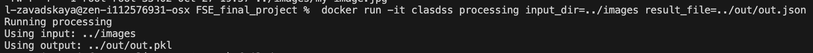
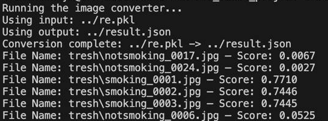

# Smoker Classifier

Smoking persons classification using pretrained ResNet50

By team 8:
* Svetlana Lukina
* Lyudmila Zavadskaya
* Pavel Gurevich
* Nikita Vybornov


## Overview
This project uses a pretrained ResNet model to classify images of smokers. 

From images to probabilities of smoking persons:

* prob: 0.02

  

* prob: 0.78

  
  

## Requirements
- Python 3.9
- torch
- torchvision
- Pillow

## Setup Instruction

1. **Clone the Repository:**
   ```bash
   git clone https://github.com/Owling797/FSE_final_project.git
   git checkout main
   ```

2. **Navigate to the Project Directory:**
   ```bash
   cd FSE_final_project
   ```

3. **Place your images into some directory:**

### Setup using Docker 

4. **Build the Docker Image:**
   ```bash
   docker build -t clasdss .
   ```
   


5. **Run the Docker Container:**

   First:
   * Find the path to your image (you can find some examples in the "image" directory)
   * Decide where to place the converted image
   * Decide where to place json result
   
   All your paths must be relative to directory "entrypoint"

   
   ```bash
   docker run -t -v <Your full path to FSE_final_project>/FSE_final_project/out/:/app/out/ clasdss input=<path to your image> output=<path to converted image> input_dir=<path to stored converted images directory> result_file=<path to json result>
   ```
   


6. **Check the result**
   ```bash
   cat <path to your json result>
   ```
   

   The entire process:
   


### Setup using Makefiles

If you're using Ubuntu, you're able to build and run this project without Docker. Here is the instruction how to do it

4. **Build the project**
   ```bash
   make prereqs
   make build
   make test
   ```

5. **Run the software**

   First:
   * Find the path to your image (you can find some examples in the "image" directory)
   * Decide where to place the converted image
   * Decide where to place json result
   
   All your paths must be relative to directory "entrypoint"

   
   ```bash
   make all input=<path to your image> output=<path to converted image> input_dir=<path to stored converted images> result_file=<path to json result>
   ```

6. **Check the result**
   ```bash
   cat <path to your json result>
   ```


## Auxilary options

1. **To Prerocess data:**

All paths must be relative to directory entrypoint
   ```bash
   make preprocessing input=<path to your image> output=<path to the result>
   ```
   or outside the container:
   ```bash
   docker run -it clasdss preprocessing input=<path to your image> output=<path to the result>
   ``` 
   


2. **To Process data:**
   ```bash
   make processing input_dir<path to stored converted images>
   ```
   or outside the container:
   ```bash
   docker run -it clasdss processing input_dir<path to stored converted images>
   ``` 
   

   Runs the neural network model on the images.

3. **To Postprocess data:**
   ```bash
   make postprocessing result_file=<path to json result>
   ```
   or outside the container:
   ```bash
   docker run -it clasdss postprocessing result_file=<path to json result>
   ```
   
   
  Analyzes the output from the neural network 

4. **Run tests**:
   ```bash
   python -m unittest test_main_model.py
   ```
   